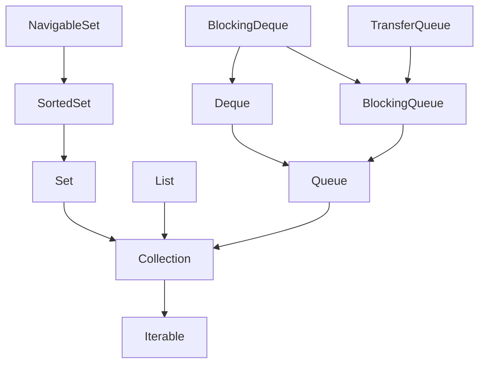
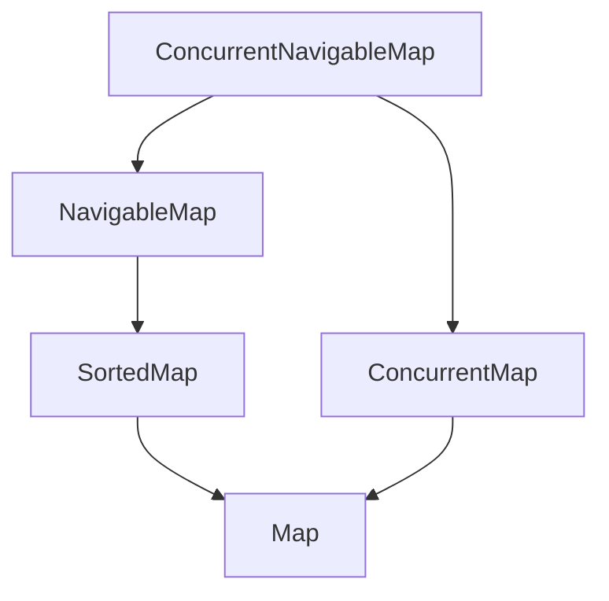

# Pengenalan Java Collection
- Collection adalah hal umum yang biasa dimiliki di bahasa pemrograman, seperti PHP, Python, Ruby, dan lain - lain.
- Collection atau kadang disebut container, adalah object yang mengumpulkan atau berisikan data - data, mirip seperti Array.
- Java telah menyediakan class - class collection yang sudah bisa langsung kita gunakan, tanpa tambahan library.
- Semua class - class collection di Java adalah generic class, sehingga kita bisa menggunakan Java collection dengan data apapun.

# Java Collection
Java collection telah menyediakan semuanya yang berhubungan dengan collection, sehingga kita hanya cukup tinggal menggunakannya.
- Interfaces, ini adalah contract representasi dari collection. Semua collection di Java memiliki kontrak interface, sehingga kita mau, kita juga bisa membuat implementasinnya sendiri.
- Implementations, tidak perlu khawatir, kita juga bisa menggunakan implementasi yang sudah dibuat oleh Java, semua interface collection sudah ada implementasi class nya di Java collection.
- Algorithms, Java juga sudah menyediakan algoritma - algoritma yang umum digunakan di collection, seperti pencarian dan pengurutan data di collection.

