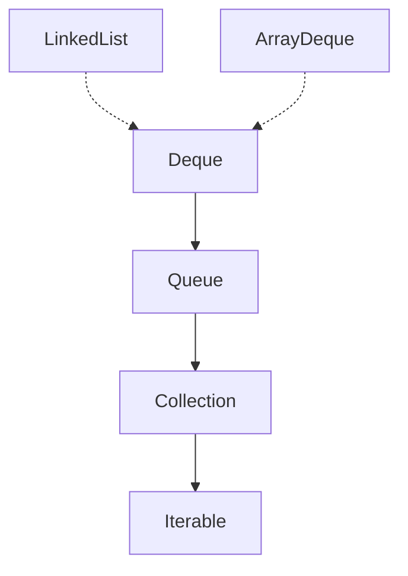

# Deque Interface
- Deque singkatan dari double ended queue, artinya queue yang bisa beroperasi dari depan atau belakang.
- Jika pada queue, operasi yang didukung ada FIFO, namun pada deque, tidak hanya FIFO, namun juga mendukung LIFO (Last In First Out).
- Bisa dibilang deque adalah implementasi struktur data antrian dan stack (tumpukan).

## Implementasi Deque


- Kode: Stack Menggunakan Deque
```java
import java.util.Deque;
import java.util.LinkedList;

public static void main(String[] args) {
    Deque<String> stack = new LinkedList<>();
    
    stack.offerLast("Sandy");
    stack.offerLast("Dwi");
    stack.offerLast("Handoko");
    
    for (var item = stack.pollLast(); item != null; item = stack.pollLast()) {
        System.out.println(item);
    }
}
```
