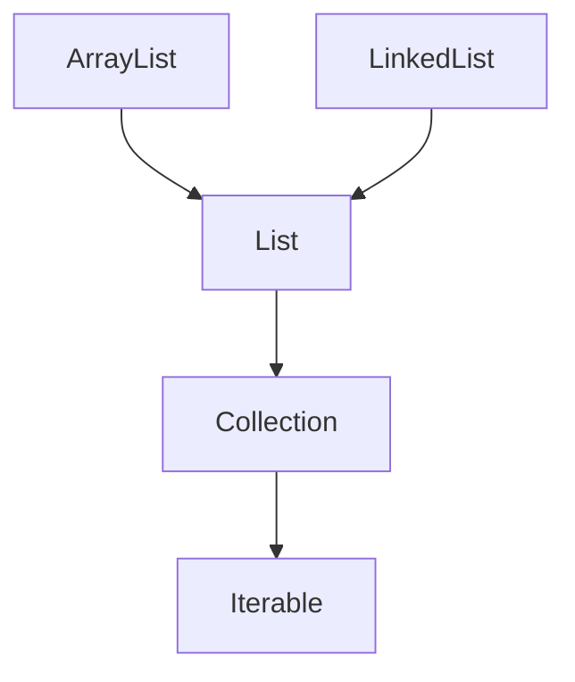

# List Interface
- List adalah struktur data collection yang memiliki sifat sebagai berikut:
  - Elemen di list bisa duplikat, artinya bisa memasukkan data yang sama.
  - Data list berurut sesuai dengan posisi kita memasukkan data.
  - List memiliki index, sehingga kita bisa menggunakan nomor index untuk mendapatkan elemen di list.
- Di Java ada beberapa implementasi List, dan kita bisa memilih sesuai dengan kebutuhan kita.

## Implementasi List


### ArrayList Class
- ArrayList adalah implementasi dari List menggunakan Array.
- Default kapasitas array di ArrayList adalah 10.
- Namun ketika kita memasukkan data dan array sudah penuh, maka secara otomatis ArrayList akan membuat array baru dengan kapasitas baru (ukuran kapasitas lama + data baru).

### LinkedList Class
- LinkedList adalah implementasi list dengan struktur data Double Linked List.
- Bagi yang sudah belajar tentang struktur data di sekolah / kampus pasti tau apa itu Double Linked List.

### ArrayList vs LinkedList
| Operasi | ArrayList | LinkedList |
|---------|-----------|------------|
| add | Cepat jika kapasitas Array masih cukup, lambat jika sudah penuh | Cepat karena hanya menambah node di akhir |
| get | Cepat karena tinggal gunakan index array | Lambat karena harus di cek dari node awal sampai ketemu index-nya |
| set | Cepat karena tinggal gunakan index array | Lambat karena harus di cek dari node awal sampai ketemu |
| remove | Lambat karena harus menggeser data di belakang yang dihapus | Cepat karena tinggal ubah prev dan next di node sebelah yang dihapus |
- Kode: List
```java
import java.util.ArrayList;
import java.util.LinkedList;
import java.util.List;

public static void main(String[] args) {
  List<String> names = new ArrayList<>();
  // List<String> names = new LinkedList<>();

  names.add("Sandy");
  names.add("Dwi");
  names.add("Handoko");
  names.add("Trapsilo");

  names.set(0, "Software Engineer");

  System.out.println(names.get(0));
  System.out.println(names.get(1));
}
```