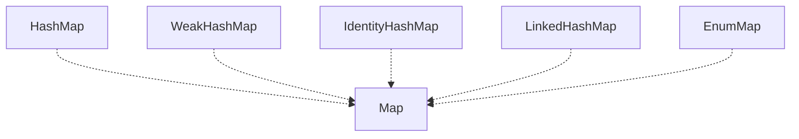

# Map Interface
- Map adalah struktur data collection yang berisikan mapping anatar key dan value.
- Dimana key di map itu harus unik, tidak boleh duplikat, dan satu key cuma boleh mapping ke satu value.
- Map sebenarnya mirip dengan Array, cuma bedanya kalo di Array, key adalah index (integer), sedangkan di Map, key nya bebas kita tentukan sesuai keinginan kita.

## Implementasi Map


### HashMap
- HashMap adalah implementasi Map yang melakukan distribusi key menggunakan hashCode() function.
- Karena HashMap sangat bergantung dengan hashCode() function, jadi pastikan kita harus membuat function hashCode() seunik mungkin, karena jika terlalu banyak nilai hashCode() yang sama, maka pendistribusian key nya tidak akan optimal sehingga proses get data di Map akan semakin lambat.
- Di HashMap pengecekan data duplikat dilakukan dengan menggunakan method equals nya.
- Kode: HashMap
```java
import java.util.HashMap;
import java.util.Map;

public static void main(String[] args) {
    Map<String, String> map = new HashMap<>();
    
    map.put("firstName", "Sandy");
    map.put("middleName", "Dwi");
    map.put("lastName", "Handoko");

    System.out.println(map.get("firstName"));
    System.out.println(map.get("middleName"));
    System.out.println(map.get("lastName"));
}
```

### WeakHashMap
- WeakHashMap adalah implementasi Map mirip dengan HashMap.
- Yang membedakkan adalah WeakHashMap menggunakan weak key, dimana jika tidak digunakan lagi maka secara otomatis data di WeakHashMap akah dihapus.
- Artinya, jika terjadi garbage collection di Java, bisa dimungkinkan data di WeakHashMap akan dihapus.
- WeakHashMap cocok digunakan untuk menyimpan data cache di memory secara sementara.
- Kode: WeakHashMap
```java
import java.util.Map;
import java.util.WeakHashMap;

public static void main(String[] args) {
    Map<Integer, Integer> map = new WeakHashMap<>();
    
    for (int i = 0; i < 1000000; i++) {
        map.put(i, i);
    }
    
    System.gc();

    System.out.println(map.size());
}
```

### IdentityHashMap
- IdentityHashMap adalah implementasi Map sama seperti HashMap.
- Yang membedakkan adalah cara pengecekan kesamaan datanya, tidak menggunakan function equals, melainkan menggunakan operator -- (reference equality).
- Artinya data dianggap sama, jika memang lokasi di memory tersebut sama.
- Kode: IdentityHashMap
```java
import java.util.IdentityHashMap;
import java.util.Map;

public static void main(String[] args) {
    String key1 = "name.first";
    
    String name = "name";
    String first = "first";
    
    String key2 = name + "." + first;
    
    Map<String, String> map = new IdentityHashMap<>();
    
    map.put(key1, "Sandy Dwi Handoko Trapsilo");
    map.put(key2, "Sandy Dwi Handoko Trapsilo");

    System.out.println(map.size());
}
```

### LinkedHashMap
- LinkedHashMap adalah implementasi Map dengan menggunakan double linked list.
- Data di LinkedHashMap akah lebih terprediksi karena datanya akan disimpan berurutan dalam linked list sesuai urutan kita menyimpan data.
- Namun perlu diperhatikan, proses get data di LinkedHashMap akan semakin lambat karena harus melakukan iterasi data linked list terlebih dahulu.
- Gunakan LinkedHashMap jika memang kita lebih mementingkan iterasi data Map nya.
- Kode: LinkedHashMap
```java
import java.util.LinkedHashMap;
import java.util.Map;

public static void main(String[] args) {
    Map<String, String> map = new LinkedHashMap<>();
    
    map.put("Sandy", "Sandy");
    map.put("Dwi", "Dwi");
    map.put("Handoko", "Handoko");
    
    for (var key : map.keySet()) {
        System.out.println(key);
    }
}
```

### EnumMap
- EnumMap adalah implementasi Map dimana key nya adalah enum.
- Karena data enum sudah pasti unik, oleh karena itu cocok dijadikan key di Map.
- Algoritma pendistribusian key dioptimalkan untuk enum, sehingga lebih optimal dibandingkan menggunakan hashCode() method.
- Kode: EnumMap
```java
import java.util.EnumMap;

public static enum Level {
    FREE, STANDARD, PREMIUM, VIP
}

public static void main(String[] args) {
    EnumMap<Level, String> map = new EnumMap<>(Level.class);
    
    map.put(Level.FREE, "Gratis");
    map.put(Level.PREMIUM, "Bayar");

    System.out.println(map.get(Level.FREE));
    System.out.println(map.get(Level.PREMIUM));
}
```

