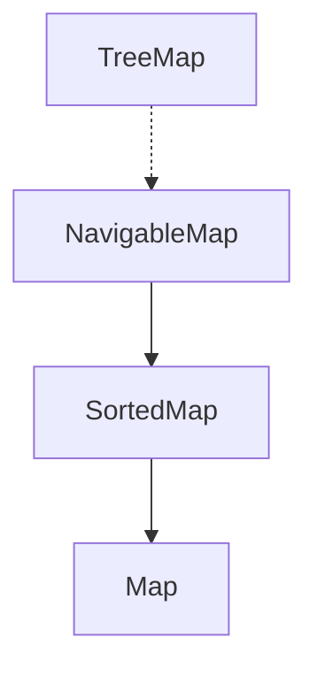

# NavigableMap Interface
- NavigableMap adalah turunan dari SortedMap.
- Namun NavigableMap memiliki kemampuan navigasi berdasarkan operasi kurang dari, lebih dari dan sejenisnya.
- Misal, kita ingin mengambil data yang lebih dari key x atau kurang dari key y, ini bisa dilakukan di NavigableMap.

## Implementasi NavigableMap

- Kode: NavigableMap
```java
import java.util.NavigableMap;
import java.util.TreeMap;

public static void main(String[] args) {
    NavigableMap<String, String> map = new TreeMap<>();
    
    map.put("Sandy", "Sandy");
    map.put("Budi", "Budi");
    map.put("Nugraha", "Nugraha");

    System.out.println(map.lowerKey("Sandy"));
    System.out.println(map.lowerKey("Sandy"));
}
```

## Membuat Immutable NavigableMap
| Method | Keterangan |
|--------|------------|
| Collections.emptyNavigableMap() | Membuat immutable navigable map kosong |
| Collections.unmodifiableNavigableMap(map) | Mengubah mutable navigable map menjadi immutable |