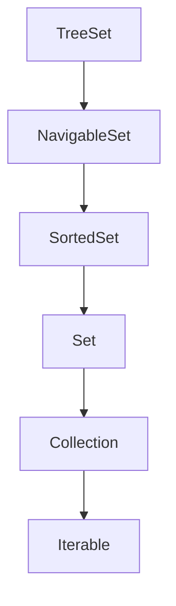

# NavigableSet Interface
- NavigableSet adalah turunan dari SortedSet.
- NavigableSet menambah method-method untuk melakukan navigasi pencarian element, seperti mencari elemen yang lebih besar dari, kurang dari, membalikkan urutan set, dan lain-lain.

## Implementasi NavigableSet

- Kode: Navigable Set
```java
import java.util.NavigableSet;
import java.util.Set;
import java.util.TreeSet;

public static void main(String[] args) {
    NavigableSet<String> names = new TreeSet<>();
    names.addAll(Set.of("Sandy", "Dwi", "Handoko", "Trapsilo"));

    NavigableSet<String> namesDesc = names.descendingSet();
    NavigableSet<String> handoko = namesDesc.headSet("Handoko", true);

    for (var name : names) {
        System.out.println(name);
    }
    System.out.println(handoko);
}
```

## Membuat Immutable NavigableSet
| Method | Keterangan |
|--------|------------|
| Collections.emptyNavigableSet() | Membuat immutable navigable set kosong |
| Collections.unmodifiableNavigableSet(set) | Mengubah mutable navigable set menjadi immutable |