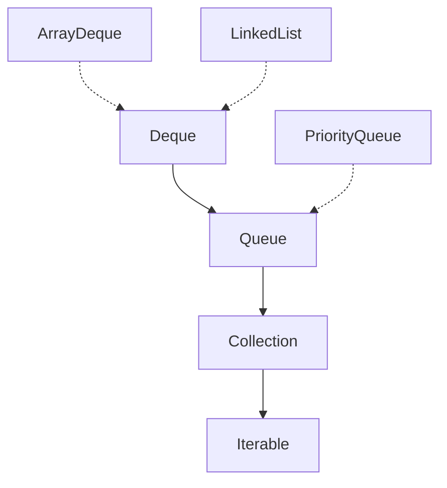

# Queue Interface
- Queue adalah implementasi dari struktur data Antrian atau FIFO (First In First Out).

## Implementasi Queue


## ArrayDeque vs LinkedList vs PriorityQueue
- ArrayDeque menggunakan array sebagai implementasi queue nya.
- LinkedList menggunakan double linked list sebagai implementasi queue nya.
- PriorityQueue menggunakan array sebagai implementasi queue nya, namun diurutkan menggunakan Comparable atau Comparator.
- Kode: Queue
```java
import java.util.Queue;

public static void main(String[] args) {
    Queue<String> queue = new ArrayDeque<>(10);

    queue.offer("Sandy");
    queue.offer("Dwi");
    queue.offer("Handoko");
    
    for (String next = queue.poll(); next != null; next = queue.poll()) {
        System.out.println(next);
    }

    System.out.println(queue.size());
}
```
