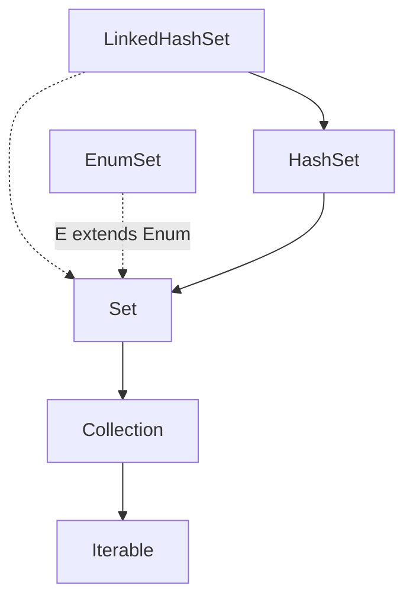

# Set Interface
- Set adalah salah satu collection yang berisikan elemen-elemen yang unik, atau tidak boleh duplicate.
- Set tidak memiliki index seperti di List, oleh karena itu tidak ada jaminan data yang ada di Set itu akan terurut sesuai dengan waktu kita memasukkan data ke Set.
- Set tidak memiliki method baru, jadi hanya menggunakan method yang ada di interface parent nya, yaitu collection dan Iterable.
- Karena tidak memiliki index, untuk mengambil data di Set juga kita harus melakukan iterasi satu per satu.
