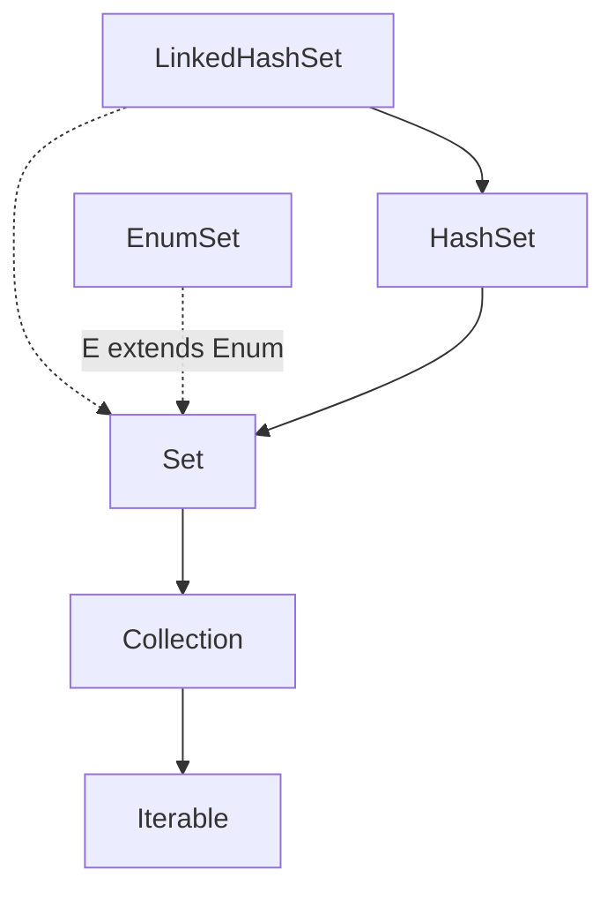

# Set Interface
- Set adalah salah satu collection yang berisikan elemen-elemen yang unik, atau tidak boleh duplicate.
- Set tidak memiliki index seperti di List, oleh karena itu tidak ada jaminan data yang ada di Set itu akan terurut sesuai dengan waktu kita memasukkan data ke Set.
- Set tidak memiliki method baru, jadi hanya menggunakan method yang ada di interface parent nya, yaitu collection dan Iterable.
- Karena tidak memiliki index, untuk mengambil data di Set juga kita harus melakukan iterasi satu per satu.

## Implementasi Set


## HashSet vs LinkedHashSet
- Di belakang HashSet dan LinkedHashSet sebenarnya sama-sama ada hash table, dimana data disimpan dalam sebuah hash table dengan mengkalkulasi hashCode() function.
- Yang membedakan adalah, HashSet **tidak menjamin data terurut** sesuai dengan waktu kita menambahkan data, sedangkan LinkedHashSet **menjamin data terurut** sesuai dengan waktu kita menambahkan data.
- Urutan data di LinkedHashSet bisa dijaga karena di belakang-nya menggunakan double linked list.
- Kode: HashSet
```java
import java.util.HashSet;
import java.util.Set;

public static void main(String[] args) {
    Set<String> names = new HashSet<>();
    
    names.add("Sandy");
    names.add("Dwi");
    
    for (String name : names) {
        System.out.println(name);
    }
}
```
- Kode: LinkedHashSet
```java
import java.util.LinkedHashSet;
import java.util.Set;

public static void main(String[] args) {
    Set<String> linkedNames = new LinkedHashSet<>();

    linkedNames.add("Sandy");
    linkedNames.add("Dwi");
    linkedNames.add("Handoko");

    for (String name : linkedNames) {
        System.out.println(name);
    }
}
```

## EnumSet
- EnumSet adalah Set yang elemen datanya harus Enum.
- Karena data Enum itu unik, sehingga sangat cocok menggunakan Set dibandingkan List.
- Kode: EnumSet
```java
import java.util.EnumSet;

public static enum Gender {
    MALE, FEMALE, NOT_MENTION
}

public static void main(String[] args) {
    // EnumSet<Gender> genders = EnumSet.allOf(Gender.class);
    EnumSet<Gender> genders = EnumSet.of(Gender.MALE, Gender.FEMALE);
    
    for (Enum gender : genders) {
        System.out.println(gender);
    }
}
```