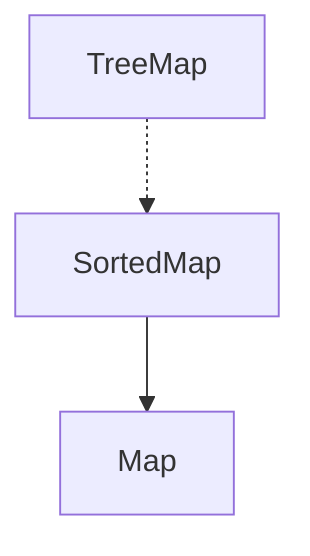

# SortedMap Interface
- SortedMap adalah implementasi Map dengan data key diurutkan sesuai dengan Comparable key atau bisa menggunakan Comparator.
- SortedMap cocok untuk kasus yang posisi key pada Map harus berurut.

## Implementasi SortedMap

- Kode: SortedMap
```java
import java.util.SortedMap;
import java.util.TreeMap;

public static void main(String[] args) {
    SortedMap<String, String> map = new TreeMap<>();
    
    map.put("Sandy", "Sandy");
    map.put("Budi", "Budi");
    map.put("Joko", "Joko");
    
    for (var key : map.entrySet()) {
        System.out.println(key);
    }
}
```
- Kode: SortedMap Menggunakan Comparator
```java
import java.util.Comparator;
import java.util.SortedMap;
import java.util.TreeMap;

public static void main(String[] args) {
    Comparator<String> stringComparator = new Comparator<String>() {
        @Override
        public int compare(String o1, String o2) {
            return o2.compareTo(o1);
        }
    };
    
    SortedMap<String, String> map = new TreeMap<>(stringComparator);
    
    map.put(new Person("Sandy"), "Sandy");
    map.put(new Person("Budi"), "Budi");
    map.put(new Person("Joko"), "Joko");
    
    for (var key : map.entrySet()) {
        System.out.println(key);
    }
}
```

## Membuat Immutable SortedMap 
| Method | Keterangan |
|--------|------------|
| Collections.emptySortedMap() | Membuat immutable sorted map kosong |
| Collections.unmodifiableSortedMap(map) | Mengubah mutable sorted map menjadi immutable |