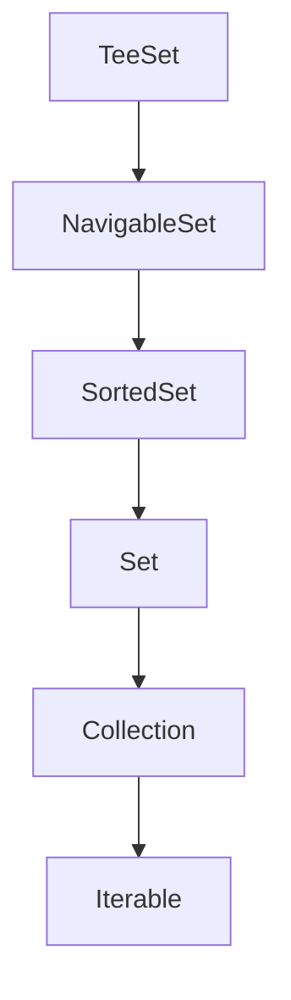

# SortedSet Interface
- SortedSet adalah turunan dari Set, namun di SortedSet elemen-elemen yang dimasukkan dalam SortedSet akan otomatis diurutkan.
- Jika element adalah turunan dari interface Comparable, maka secara otomatis akan diurutkan menggunakan comparable tersebut.
- Jika element bukan turunan dari interface Comparable, maka kita bisa menggunakan Comparator untuk memberi tahun di SortedSet bagaimana cara mengurutkan elemen-elemen nya.

## Implementasi SortedSet

- Kode: Person Comparator
```java
public class PersonComparator implements Comparator<Person> {
    @Override
    public int compare(Person o1, Person o2) {
        return o1.getName().compareTo(o2.getName());
    }
}
```
- Kode: SortedSet
```java
import data.Person;
import data.PersonComparator;

import java.util.SortedSet;
import java.util.TreeSet;

public static void main(String[] args) {
    SortedSet<Person> people = new TreeSet<>(new PersonComparator());
    
    people.add(new Person("Sandy"));
    people.add(new Person("Dwi"));
    people.add(new Person("Handoko"));
    
    for (var person : people) {
        System.out.println(person.getName());
    }
}
```

## Membuat Immutable SortedSet
| Method | Keterangan |
|--------|------------|
| Collections.emptySortedSet() | Membuat immutable sorted set kosong |
| Collections.unmodifiedSortedSet(set) | Mengubah mutable sorted set menjadi immutable |